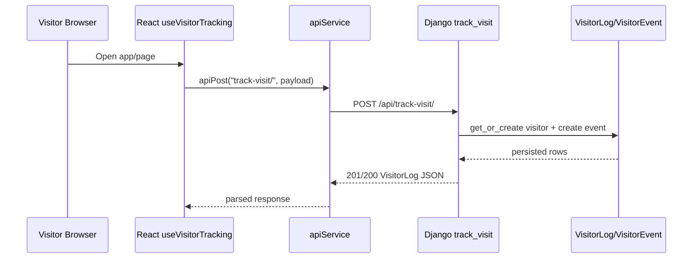
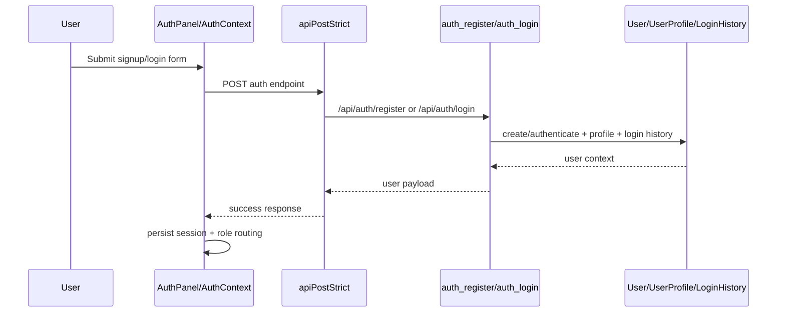
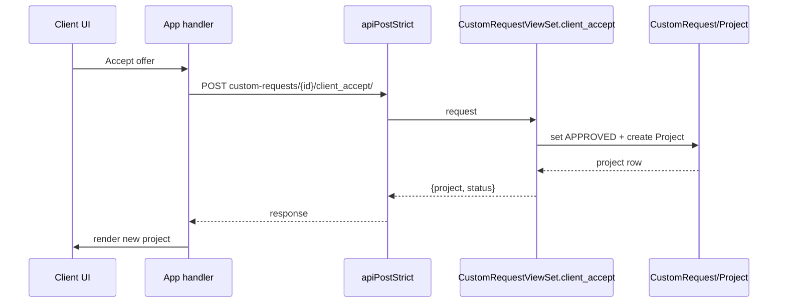
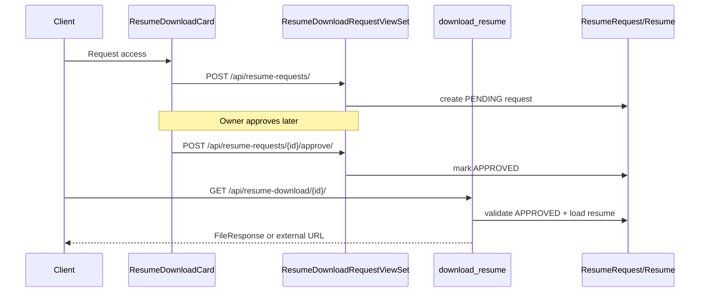

# Role-wise execution flows (frontend → backend)

## Roles identified in code

- **Visitor** (anonymous, not signed in)
- **CLIENT**
- **EMPLOYEE**
- **OWNER** (admin)

## Functionalities by role

### Visitor
- Browse landing/templates
- Auto visitor tracking (`track-visit`)
- Sign up / sign in

### CLIENT
- Submit custom request
- Accept owner offer (creates project)
- Request resume download access
- Download approved resume

### EMPLOYEE
- View assigned tasks
- Update task status
- Submit deliverables

### OWNER
- Review/respond to custom requests
- Approve project completion
- Review user/visitor logs
- Approve/reject resume download requests
- Update site/email settings

---

## Flow 1: Visitor tracking

1. `AppShell` mounts and runs `useVisitorTracking(user)`.
2. Hook builds payload (`visitor_id`, path, user agent context) and calls `apiPost('track-visit/')`.
3. Frontend `apiService` sends `POST /api/track-visit/`.
4. Backend `track_visit` (`backend/api/views.py`) upserts `VisitorLog`, appends `VisitorEvent`, optionally sends admin alert.
5. Serializer response returns visitor snapshot to frontend.



## Flow 2: Sign up / login

1. `AuthPanel` submits credentials via `AuthContext.register/login`.
2. `apiPostStrict` calls `POST /api/auth/register/` or `POST /api/auth/login/`.
3. Backend creates/authenticates user, ensures `UserProfile`, records `LoginHistory`.
4. Frontend persists user session in local storage and routes by role.



## Flow 3: CLIENT request accepted into project

1. Client clicks “Accept Offer & Initialize Project”.
2. `App` calls `POST /api/custom-requests/{id}/client_accept/`.
3. Backend `client_accept` changes request to `APPROVED`, creates `Project`, computes `advance_amount`.
4. UI updates custom request + prepends created project.



## Flow 4: Resume access request and download

1. Client requests access in `ResumeDownloadCard`.
2. Frontend posts `POST /api/resume-requests/`.
3. Owner approves from dashboard (`POST /api/resume-requests/{id}/approve/`).
4. Client downloads through `GET /api/resume-download/{request_id}/` after approval.



## Flow 5: EMPLOYEE task pipeline

1. Employee changes task status in dashboard.
2. Frontend calls task status endpoint.
3. Backend validates status and updates task.
4. Updated task state reflects in UI and analytics.

```mermaid
flowchart LR
  A[Employee clicks status chip] --> B[React handler]
  B --> C[POST /api/tasks/{id}/update_status/]
  C --> D[Django TaskViewSet.update_status]
  D --> E[(Task table)]
  E --> D
  D --> F[JSON response]
  F --> G[Dashboard state updated]
```

---

## Troubleshooting notes

- If frontend `npm run build` / `npm run lint` fail with `Permission denied`, run through Node-backed scripts (already configured in `frontend/package.json`).
- If backend tests run against unexpected external DB, set `DATABASE_URL`; fallback now defaults to local SQLite.
- Visitor tracking requires `visitor_id`; missing value returns HTTP 400 by design.

## Test mapping

- `backend/api/tests.py::AuthFlowTests` validates register/login behavior.
- `backend/api/tests.py::VisitorTrackingTests` validates visitor upsert/event creation.
- `backend/api/tests.py::RequestToProjectFlowTests.test_client_accept_offer_creates_project` validates client offer acceptance → project creation.
- `backend/api/tests.py::RequestToProjectFlowTests.test_resume_request_approval_enables_download` validates request/approve/download resume path.
